## Fluxo

O aplicativo inicia na tela SplashScreen após isso é automaticamente redirecionada para tela IntroScreen onde possui duas opções uma de voltar que não faz nada e uma de avançar que leva para HomeScreen,
a tela HomeScreen é a tela central aonde você pode acessar 3 outras telas,
a ComoFuncionaScreen que explica como o aplicativo fucniona,
a ComoPrepararScreen que tem uma checklist de items que você precisa ter pra caso algum desastre acontecer você esteja preparado para diminuir os danos, 
e a MonitorarScreen que é uma tela que apresenta todas as regiões cadastradas e quando você clica na região aparece um Card com as informações dela,
nesse card tem um botão de "Registros", esse botão leva para tela onde aparecerá todas os registro da região selecionada

 

SplashScreen -> IntroScreen (duas opções) -> botão "voltar"  não faz nada 
                              ->  botão "Avançar" -> HomeScreen  
 
HomeScreen(três opções) -> botão "Como funciona" -> ComoFuncionaScreen  
                        -> botão "Monitorar agora" -> MonitorarScreen  
                        -> botão "Como se preparar?" ComoPrepararScreen  

MonitorarScreen(duas opções) -> botão "Registros" -> RegistrosScreen  
                             -> botão "<-" -> HomeScreen  

ComoFuncionaScreen,ComoPrepararScreen,RegistrosScreen também podem retornar para a tela anterior  

RegistrosScreen -> MonitorarScreen  
ComoFuncionaScreen -> HomeScreen  
ComoPrepararScreen -> HomeScreen  

## SplashScreen

 

 

## IntroScreen

 

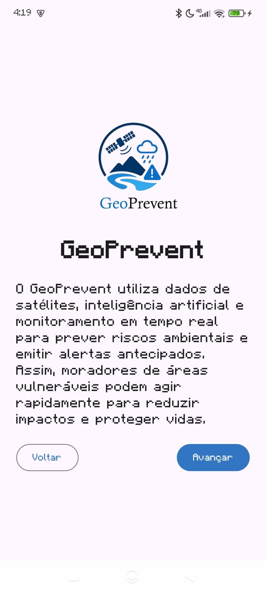

 

## HomeScreen

 

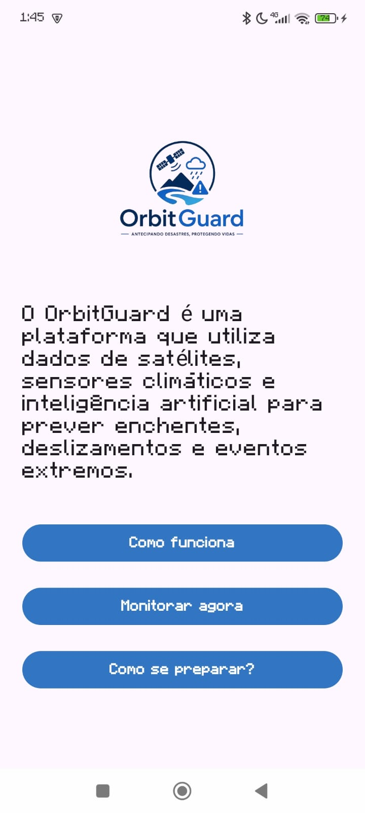

 

## ComoFuncionaScreen

 

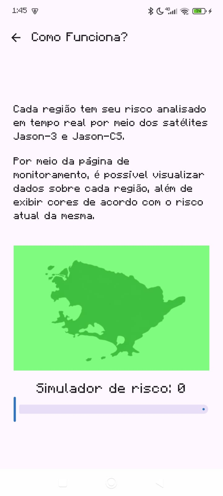
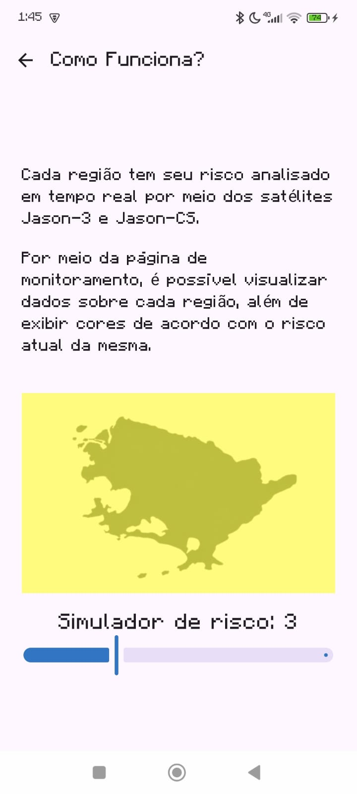
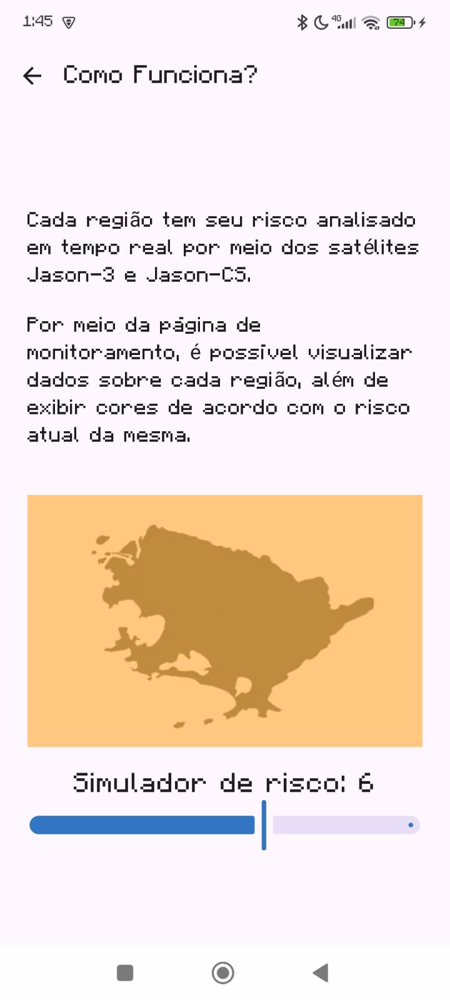
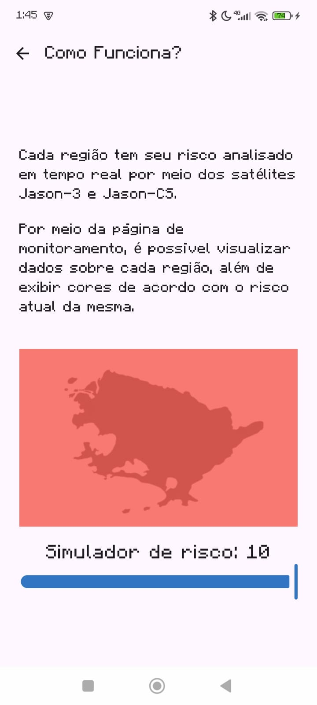

 

## ComoPreparaScreen

 

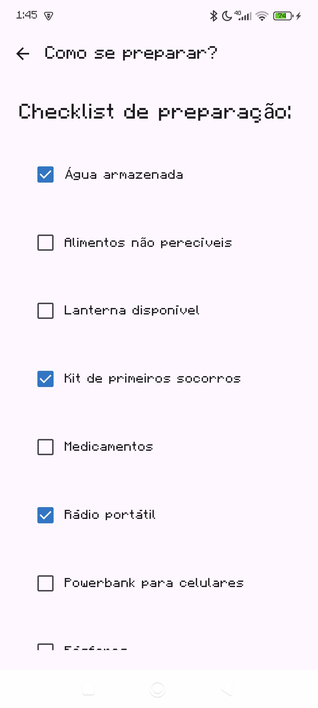
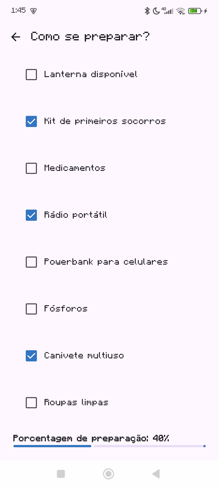

 

## MonitoramentoScreen

 

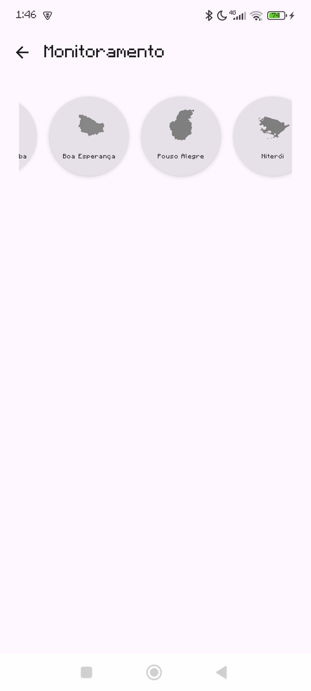
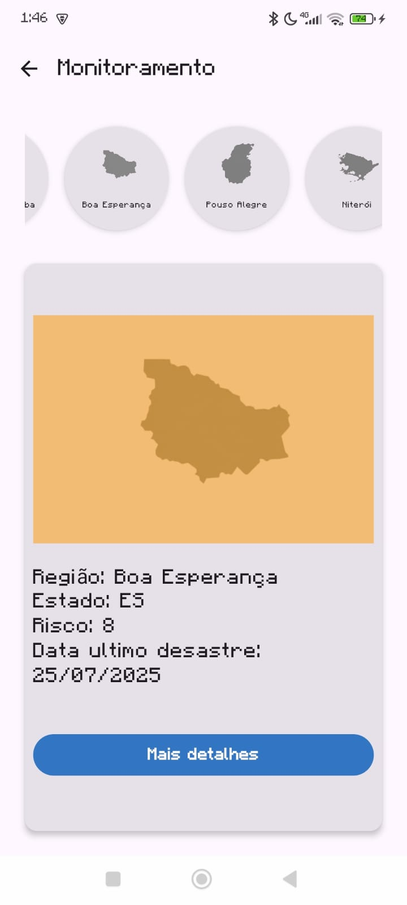

 

## RegistrosScreen

 

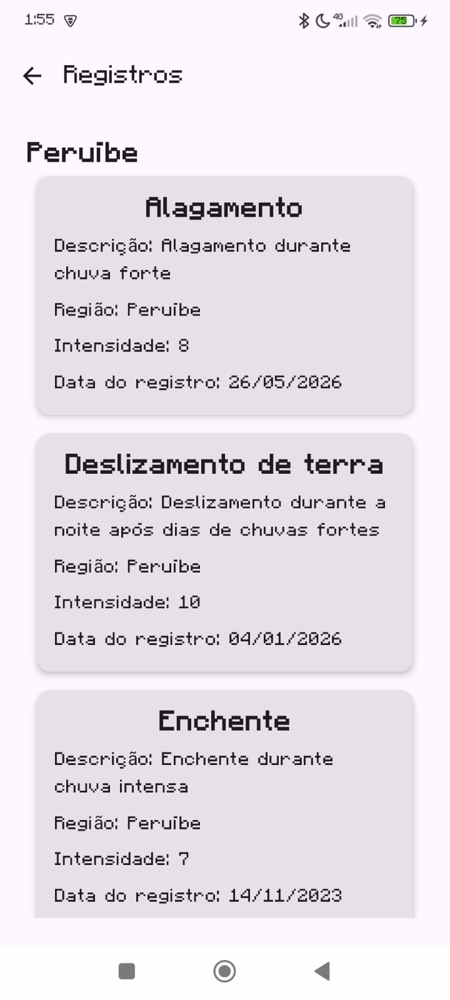

 

