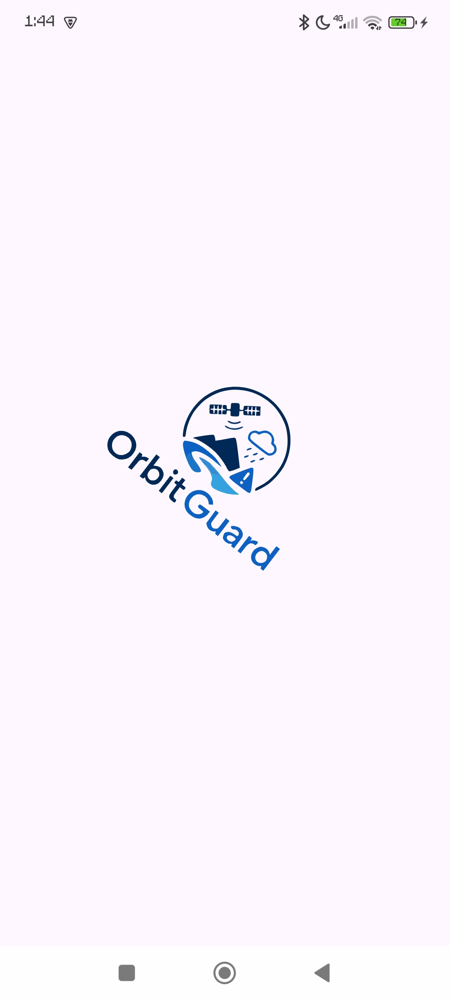

## Fluxo

SplashScreen -> IntroScreen (duas opções) -> botão "voltar"  fecha o app
                              ->  botão "Avançar" -> HomeScreen  

HomeScreen(três opções) -> botão "Como funciona" -> ComoFuncionaScreen
                        -> botão "Monitorar agora" -> MonitorarScreen
                        -> botão "Como se preparar?" ComoPreparaScreen

MonitorarScreen(duas opções) -> botão "Mais detalhes" -> MaisDetalhesScreen
                             -> botão "<-" -> HomeScreen

ComoFuncionaScreen,ComoPreparaScreen,MaisDetalhesScreen também podem retornar para a tela anterior

MaisDetalhesScreen -> MonitorarScreen
ComoFuncionaScreen -> HomeScreen
ComoPreparaScreen -> HomeScreen

## SplashScreen

 

